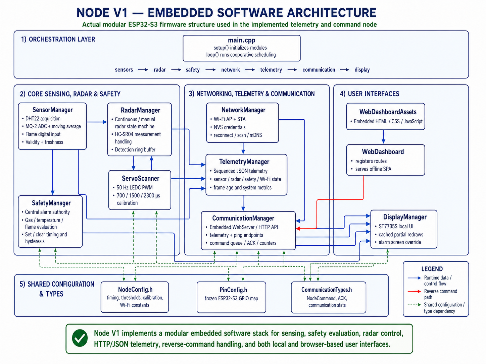
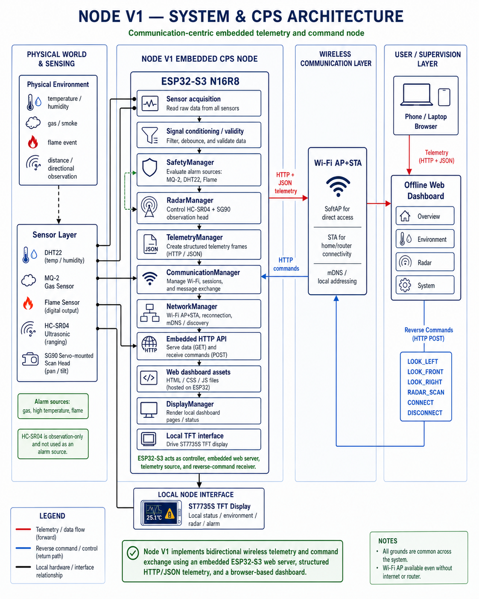
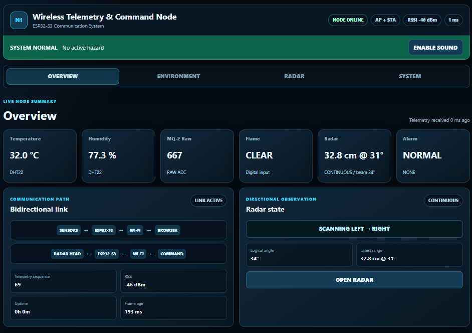
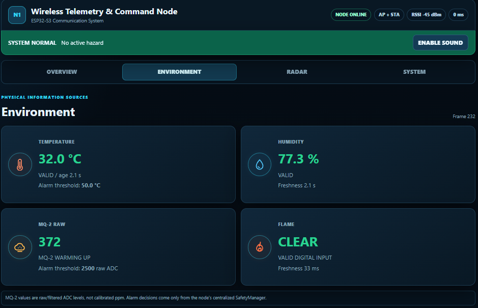
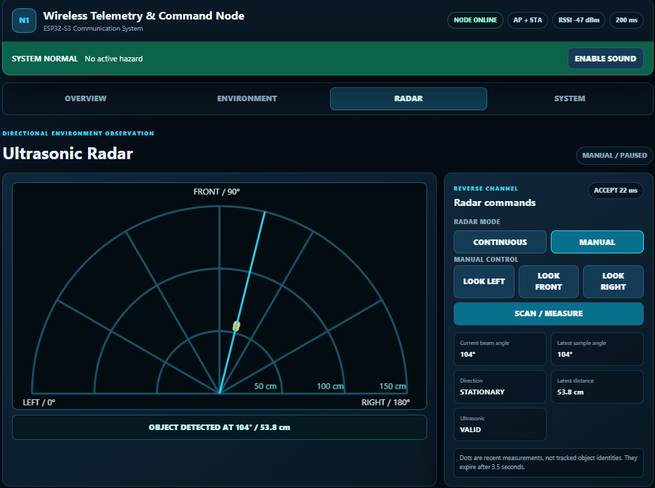
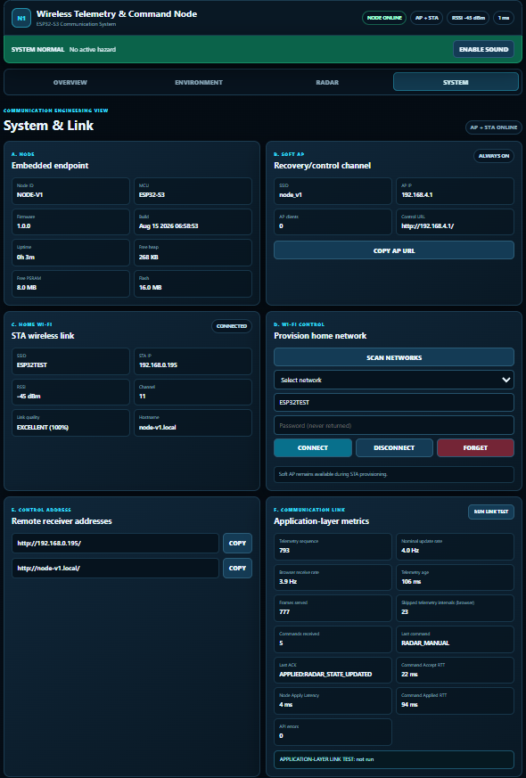
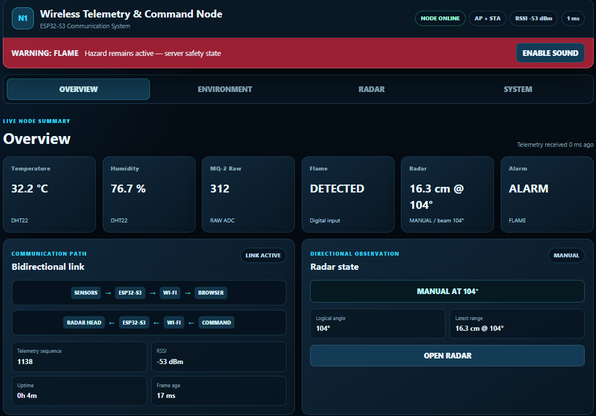

# CPS Node V1 Physical Development

**ESP32-S3 Bidirectional Wireless Telemetry and Command Node for Cyber-Physical Monitoring**

<p align="center">
  
</p>

*CPS Node V1 physical prototype integrating environmental sensing, directional ultrasonic observation, local visualization, wireless communication, and portable power.*

CPS Node V1 is a physically implemented, communication-centric embedded cyber-physical systems node. It combines environmental sensing, a directional ultrasonic sensor head, local TFT visualization, ESP32-S3 processing, concurrent Wi-Fi SoftAP and station connectivity, embedded HTTP/JSON telemetry, reverse commands, acknowledgement and state reporting, and browser-based human supervision.

## Project Overview

Node V1 closes a bidirectional loop between physical observations and operator-directed action:

```text
environment → sensing → embedded processing → structured telemetry
→ HTTP/JSON → Wi-Fi → browser supervision → reverse command
→ physical sensor-head action → acknowledgement/state update
```

The node acquires sensor data, evaluates validity and freshness, maintains a centralized alarm state, and exposes structured local telemetry. An operator can inspect the live state in a browser and send directional commands to the SG90-mounted HC-SR04 head; command acceptance, application, and resulting node state are returned through the communication interface.

## Engineering Objective

Node V1 was developed as more than a sensor dashboard. Its engineering objective is to make the complete application-layer communication loop observable: sensor validity, sample freshness, local availability, network state, sequenced telemetry, reverse-command admission, command acknowledgement, physical response, and updated system state.

This local-first design preserves a direct SoftAP recovery/control path while also supporting infrastructure-network access in station mode. Safety decisions remain on the embedded node rather than being delegated to the browser.

## Key Features

- ESP32-S3 N16R8 controller and Wi-Fi endpoint
- DHT22 temperature and humidity acquisition
- MQ-2 raw 12-bit ADC sensing with a moving-average filtered value
- Active-low digital flame-event sensing
- HC-SR04 ultrasonic observation on an SG90 directional head
- ST7735S 1.8-inch TFT local interface
- Portable 2S 18650 power system with regulated 5 V rail
- Concurrent Wi-Fi SoftAP + STA operation and mDNS discovery
- Self-contained embedded web server with no cloud or CDN dependency
- Structured HTTP/JSON telemetry with sequence, freshness, and validity fields
- Centralized `SafetyManager` state shared by telemetry, TFT, and browser views
- Bounded command queue with command IDs and acceptance/application acknowledgement
- Modular cooperative firmware architecture with explicit subsystem ownership

## Communication Architecture

<p align="center">
  
</p>

The forward path converts physical observations from the DHT22, MQ-2, flame sensor, and directional HC-SR04 into validated and timestamped state. The ESP32-S3 packages that state as sequenced JSON telemetry, serves it over HTTP, and delivers it through either the direct SoftAP path or a local infrastructure network to the browser dashboard.

The reverse path carries a validated browser command by HTTP POST to the ESP32-S3. A bounded command queue separates acceptance from application; the radar state machine then applies the command to the SG90 sensor head, while correlated acknowledgement and updated radar state return in telemetry.

This repository documents application- and system-layer communication. It does not report BER, SNR, PHY throughput, RF packet-loss characterization, or zero-latency operation.

Technical details:

- [Embedded HTTP API](docs/API.md)
- [Communication Architecture](docs/COMMUNICATION_ARCHITECTURE.md)

## Electrical and Power Architecture

<p align="center">
  
</p>

The portable supply uses two 18650 cells in a 2S arrangement, a charging/protection module, a main switch, and an LM2596 converter for the regulated 5 V rail. The ESP32-S3, sensors, TFT, and servo share a common ground. The prototype includes appropriate interface consideration for MQ-2 analog scaling and HC-SR04 ECHO-level protection before signals reach the 3.3 V controller domain.

The ESP32-S3 interfaces with the DHT22, MQ-2, flame module, HC-SR04, ST7735S TFT, and SG90. This is prototype engineering documentation, not a certified electrical design. Verify polarity, cell condition, charger/protection compatibility, converter output, common grounding, logic-level protection, and wiring before energizing or reproducing the system. Do not use the sensing or alarm functions as substitutes for certified safety equipment.

## Hardware and Prototype Cost

The implementation uses commercially available embedded modules organized around the ESP32-S3 N16R8:

| Subsystem | Main hardware |
|---|---|
| Controller and communication | ESP32-S3 N16R8 development board |
| Environmental sensing | DHT22, MQ-2, flame sensor |
| Directional observation | HC-SR04 and SG90 servo |
| Local interface | 1.8-inch ST7735S TFT |
| Portable power | Two 18650 cells, 2S charging module, LM2596, holder, and switch |

**Author-reported prototype hardware cost: approximately BDT 2,985.**

This historical build value excludes labor, development tools, computing equipment, spares, and unlisted fabrication materials. It is neither a current market quotation nor a claim of economic superiority. See the [Hardware Bill of Materials and Prototype Cost](docs/NODE_V1_HARDWARE_BOM_AND_COST.md) for the itemized record.

## Embedded Software Architecture

<p align="center">
  
</p>

The firmware is divided into cohesive managers and presentation components:

- `SensorManager` owns environmental acquisition, filtering, validity, and freshness.
- `ServoScanner` generates calibrated hardware PWM for the directional head.
- `RadarManager` owns sweep/manual state, trigger-time angle association, range status, and recent observations.
- `SafetyManager` is the authoritative source for gas, temperature, and flame alarm state.
- `NetworkManager` maintains SoftAP, STA, saved connection state, and mDNS.
- `TelemetryManager` builds the sequenced transmission representation.
- `CommunicationManager` serves APIs, validates commands, manages admission, and records acknowledgements.
- `DisplayManager` presents local state on the TFT.
- `WebDashboard` and `WebDashboardAssets` provide the self-contained browser interface.
- `main.cpp` cooperatively orchestrates subsystem updates and applies pending commands.

The design is cooperative rather than hard real time. Its non-blocking state machines and explicit subsystem ownership are intended to keep sensing, communication, control, and presentation responsive within the prototype's documented limits. See the [Software Engineering Audit](docs/NODE_V1_SOFTWARE_AUDIT_FOR_PAPER.md) for implementation evidence and claim boundaries.

## Cyber-Physical System Architecture

<p align="center">
  
</p>

The architecture couples physical acquisition and sensor-head actuation with embedded state ownership, local safety evaluation, network representation, and human supervision. The browser observes node truth and requests bounded actions; the ESP32-S3 remains responsible for applying commands and reporting the resulting physical and cyber state.

## Dashboard and Human Supervision

The embedded dashboard brings telemetry, environmental state, radar observations, commands, communication status, and provisioning information into one local interface.

<p align="center">
  
  
  
  
</p>

*Dashboard overview, environmental telemetry, directional observation, and system/network state.*

<p align="center">
  
</p>

*Captured alarm-state evidence during flame detection.*

Displayed values are prototype operating snapshots. MQ-2 values are raw/filtered ADC observations rather than calibrated gas concentration, and none of the displayed readings constitute certified metrology or life-safety data.

## Functional Validation

The documented functional-validation session produced the following observations:

| Test | Observation under tested conditions |
|---|---|
| Integrated operation | More than one hour without an observed crash or loss of core functionality |
| Dashboard | Remained responsive during normal telemetry and command use |
| Direct SoftAP | Operational at approximately 50–60 ft (15–18 m) indoors |
| STA/home network | Accessible throughout an approximately 1800 ft² tested residence |
| Remote directional control | Commands applied at approximately 50–80 ft (15–24 m) under the tested network conditions |
| Command response | No human-perceptible delay affecting manual operation was observed |
| Alarm observation | No false alarm was observed during the validation interval |

These are functional prototype observations, not guaranteed range, latency, reliability, or false-alarm specifications. Test conditions were uncontrolled and exact command counts and numerical RTT data were not retained. See the [Functional Validation Test Report](docs/NODE_V1_FUNCTIONAL_VALIDATION_TEST_REPORT.md) for methods, boundaries, and supported interpretations.

## Communication Engineering Significance

Node V1 demonstrates a complete local browser-to-physical-node communication loop rather than one-way sensor display. Its structured telemetry carries identity, sequence, validity, freshness, alarm, network, radar, command, and runtime state. The reverse path distinguishes command acceptance from application and exposes the resulting physical response through correlated acknowledgement and state updates.

Concurrent SoftAP and STA operation provides router-independent local availability alongside infrastructure-network access. Together, application-layer observability, local-first networking, centralized node truth, and human-in-the-loop command feedback make the implementation a practical baseline for controlled communication and CPS experiments without claiming first-of-its-kind novelty.

## Current Limitations

- Single-node prototype validated in one uncontrolled indoor environment
- No BER, SNR, PHY throughput, noise-floor, or RF packet-loss characterization
- No retained numerical RTT dataset or synchronized one-way-latency measurement
- Raw/filtered, uncalibrated MQ-2 ADC values rather than ppm concentration
- No safety certification or statistically established false-alarm rate
- Plaintext HTTP with no TLS, application authentication, authorization, or CSRF protection
- Cooperative scheduling rather than deterministic hard-real-time execution
- Prototype-grade wiring, power integration, and mechanical assembly
- No physical servo-position feedback despite software PWM-readiness reporting
- Multi-node operation, contention, addressing, and event sharing have not been evaluated

## Future Research

- Quantitative command-RTT, acknowledgement, telemetry-continuity, and reconnect logging
- Longer stability testing with resource, interruption, and recovery records
- Encrypted and authenticated local communication
- Calibrated environmental sensing and controlled validation
- Multi-node communication, addressing, and event sharing
- Integration into future intelligent robotics and distributed CPS monitoring systems

These are research directions, not implemented Node V1 features.

## Repository Structure

| Path | Contents |
|---|---|
| `docs/` | API, communication architecture, hardware cost, software audit, and functional-validation evidence |
| `figures/` | Prototype, circuit, architecture, dashboard, and alarm-state figures |

This public release is intentionally limited to engineering documentation and physical-development evidence; manuscript files are maintained separately.

## Project Developer

**Md. Habibur Rahman Habib**  
**Undergraduate Student & Research Assistant**  
Department of Electrical and Electronic Engineering  
School of Engineering, Technology and Sciences  
Independent University, Bangladesh  
Dhaka, Bangladesh  
Email: 2312190@iub.edu.bd  

**Project Developer — CPS Node V1**

## Publication Status

> Research manuscript preparation based on this prototype is being considered separately. Publication metadata will be added only after formal submission or publication.

## Responsible Use

CPS Node V1 is a supervised research prototype. Independently verify the electrical design, wiring, voltage levels, battery protection, and environmental-sensor limitations before reproduction. Do not expose the plaintext HTTP interface to hostile or untrusted networks, and do not use the prototype as certified safety, fire, gas, or environmental-monitoring equipment.
