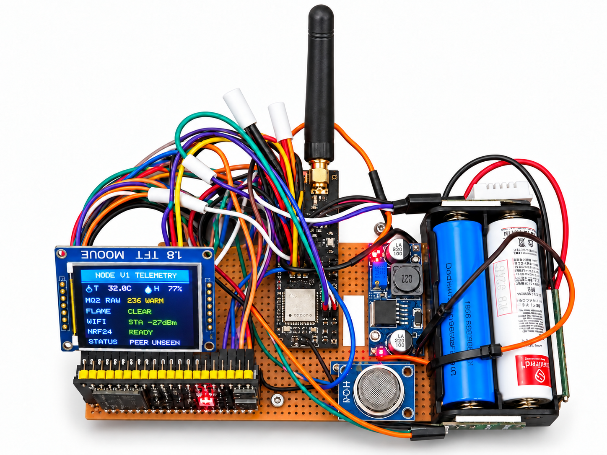
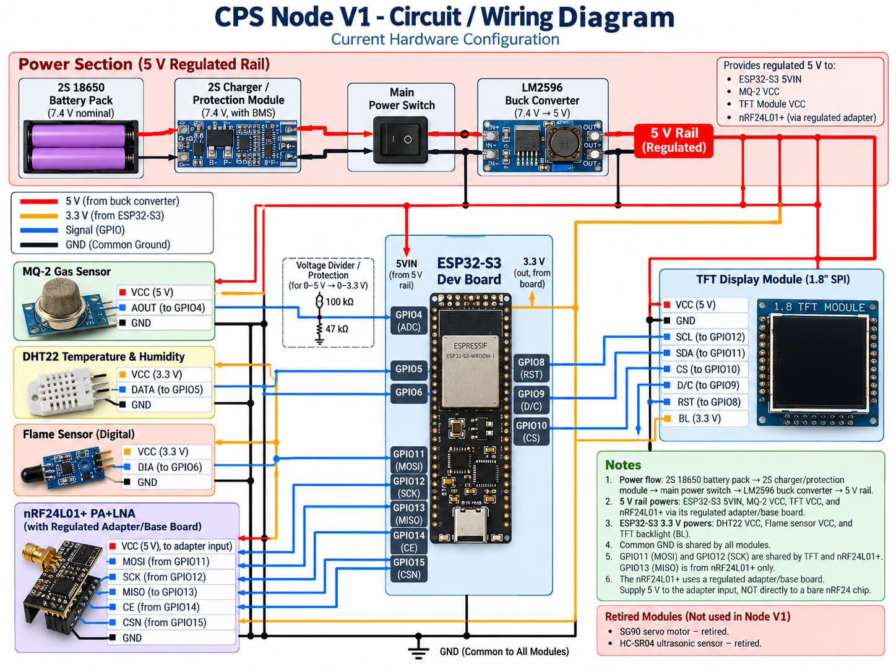
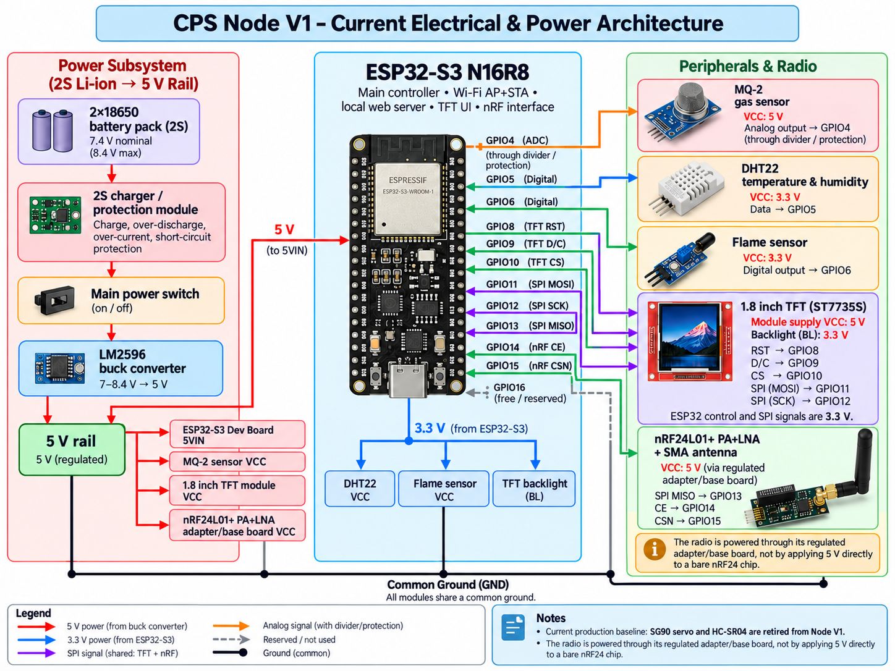
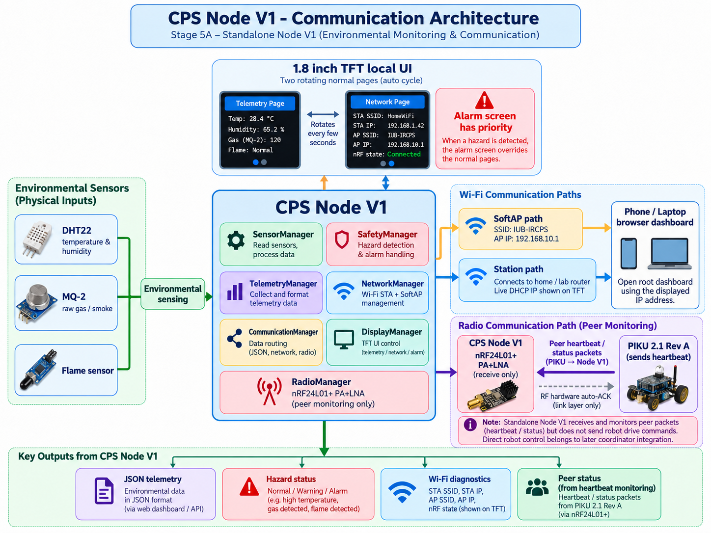
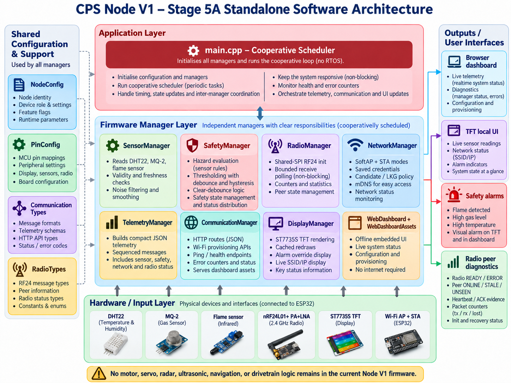
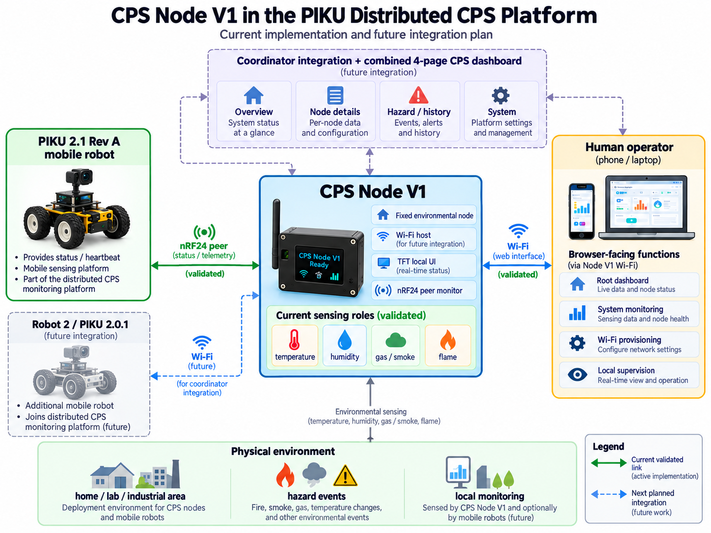
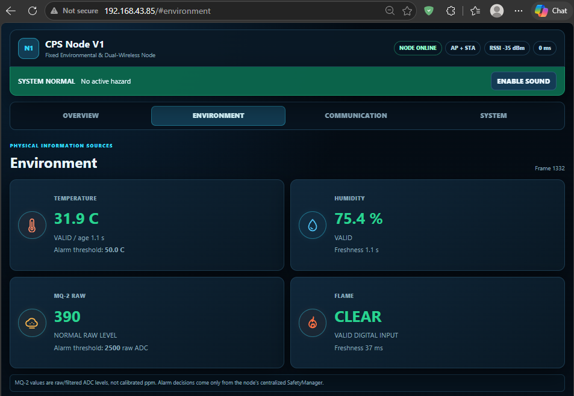
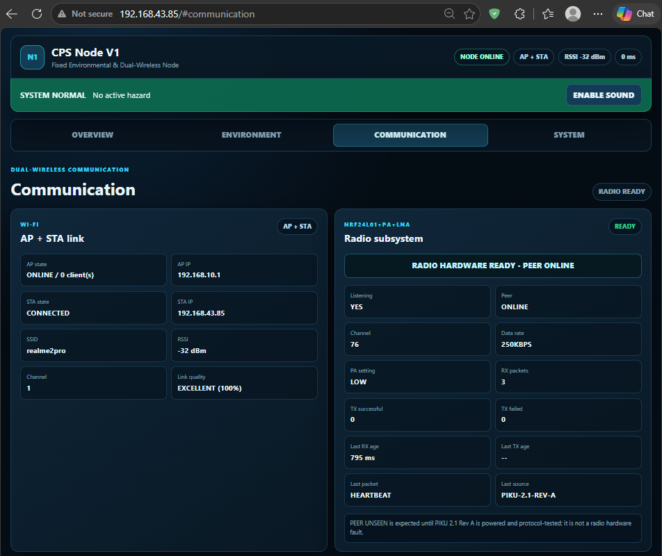
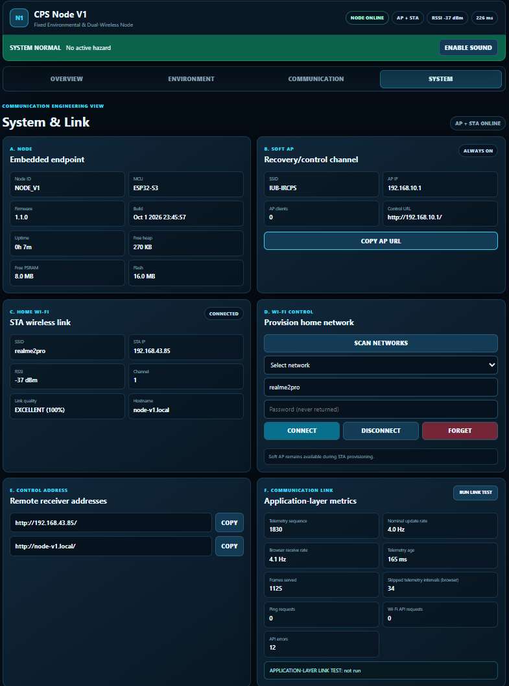
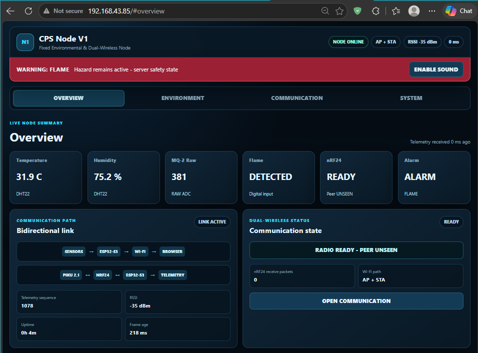

# CPS Node V1 Physical Development

CPS Node V1 is a **fixed environmental cyber-physical system (CPS) node** built around an ESP32-S3 N16R8. It reads temperature, humidity, gas/smoke ADC values and digital flame status, evaluates local alarms, and displays telemetry on a TFT and an embedded browser dashboard. Wi-Fi provides dashboard access; nRF24 provides local radio health and PIKU 2.1 Rev A peer monitoring.

This repository contains the physical design, user-prepared figures and bounded validation evidence. The [frozen Software Development release](docs/SOFTWARE_RELEASE_REFERENCE.md) owns firmware behavior, architecture and API details.

## Current release and status

**Stage 5A standalone: owner-reported supervised physical functional PASS, 2026-10-02.**

| Release reference | Value |
|---|---|
| Validated software executable | `8f6939949cfb0ee3c0feb9319f0e6a2dd87de42b` |
| Released software main merge | `70ef949ce18ab81cbc207fed13bcc320d8b99964` |
| Software release tag | `nodev1-stage5a-standalone-physical-validated-20261002` |
| Physical documentation release tag | `nodev1-physical-stage5a-synchronized-20261002` |

Physical PASS is the project owner's report, not a Codex hardware test or an instrumented performance result. Stage 5B coordinator integration remains future work.

## Current prototype

*The current assembly combines environmental sensors, TFT, regulated radio adapter and portable power. The TFT snapshot shows environmental telemetry, local radio READY and peer UNSEEN; READY alone does not establish a peer link.*

## What Node V1 currently does

- Reads DHT22 temperature/humidity, MQ-2 raw/filtered ADC values and active-low digital flame status, with validity and age information.
- Uses centralized alarm evaluation shared by TFT and browser presentation.
- Alternates TFT telemetry and network pages; alarms override normal pages.
- Shows the actual connected STA SSID and current DHCP IP separately from the SoftAP identity/IP.
- Serves a self-contained browser dashboard with **Overview, Environment, Communication and System** views.
- Keeps SoftAP access available alongside STA networking and candidate/last-known-good (LKG) provisioning.
- Monitors local nRF hardware and recognized PIKU heartbeat/status evidence, with bounded, nonfatal radio recovery.

**Retired historical functions:** SG90, HC-SR04, radar head and directional scan-head control. There is no current Radar dashboard page or head-control API. Standalone Stage 5A does not send application-level robot drive commands over nRF.

## Current hardware

| Subsystem | Installed hardware | Role |
|---|---|---|
| Controller | ESP32-S3 N16R8 | Sensing, alarms, TFT, Wi-Fi and radio interface |
| Environmental inputs | DHT22, MQ-2, digital flame sensor | Temperature/humidity, gas/smoke ADC and flame indication |
| Local interface | 1.8-inch ST7735S TFT | Telemetry, network, alarm and radio presentation |
| Peer radio | nRF24L01+ PA+LNA with SMA antenna, on regulated adapter/base board | PIKU peer monitoring |
| Portable power | Two 18650 cells in 2S, 2S charger/protection module, main switch, LM2596 | Regulated 5 V rail and common ground |

See the [hardware architecture and GPIO map](docs/HARDWARE_ARCHITECTURE.md) and [BOM/cost record](docs/NODE_V1_HARDWARE_BOM_AND_COST.md). Current radio/adapter costs are not recorded, so no current build total is claimed.

## Circuit and wiring architecture

*Environmental inputs use GPIO4/5/6. TFT controls use GPIO8/9/10. Shared SPI uses GPIO11/12/13, with nRF CE/CSN on GPIO14/15; GPIO16 is free/reserved. MQ-2 analog protection remains part of the design.*

The TFT and radio share the SPI bus with separate device selects. The [detailed pin map](docs/HARDWARE_ARCHITECTURE.md) describes these connections; the diagram is a design overview, not proof of measured electrical margins.

## Power architecture

*2S battery pack -> charger/protection module -> main switch -> LM2596 -> regulated 5 V rail. All modules share common ground.*

The 5 V rail supplies ESP32 5VIN, TFT VCC, MQ-2 VCC and the **regulated nRF adapter input**. ESP32 3V3 supplies DHT22, flame sensor and TFT backlight. Do not apply 5 V directly to a bare nRF24 chip. See [power and interface architecture](docs/POWER_AND_INTERFACE_ARCHITECTURE.md) for reproduction checks, including MQ-2 analog scaling.

## Communication architecture

*Sensors feed local safety and telemetry; TFT and Wi-Fi expose node state. PIKU heartbeat/status packets feed peer monitoring. RF hardware auto-ACK is a link-layer response, not an application robot command.*

To open the dashboard, use the current STA IP shown on the TFT from the same router network. Alternatively, join SoftAP **IUB-IRCPS** using owner-provided provisioning information and open `http://192.168.10.1/`. SoftAP and STA have separate addresses. See [communication architecture](docs/COMMUNICATION_ARCHITECTURE.md) for candidate/LKG and radio-state meanings.

## Software relationship

*The cooperative application connects sensing, centralized alarms, network/radio state, telemetry and presentation. Firmware implementation and exact API fields belong to the frozen software release.*

The application schedules manager updates cooperatively; the underlying ESP32 runtime still provides its own tasks. DHT acquisition is synchronous, so the diagram's responsiveness wording is not a hard real-time guarantee. Radio counters describe source-defined diagnostics, not measured RF packet loss. Read the [software release reference](docs/SOFTWARE_RELEASE_REFERENCE.md) for implementation authorities.

## Distributed CPS platform context

*Solid validated paths represent owner-reported Node V1/PIKU peer visibility and local browser access. Dashed paths represent future coordinator integration and the combined CPS dashboard.*

The RF path represents peer evidence and link-layer acknowledgement, not current Node V1 application robot driving. Robot 2 / PIKU 2.0.1 is a **future Wi-Fi integration path**; no current Robot 2 integration or nRF role is claimed. The platform illustration does not establish industrial deployment or a finished enclosure.

## Current dashboard evidence

### Environment

*Temperature, humidity, MQ-2 raw ADC and digital flame status, with validity/freshness information. MQ-2 ADC values are not calibrated ppm.*

### Communication

*This captured session shows local radio READY and PIKU peer ONLINE separately, alongside STA and SoftAP state. The displayed STA IP is a session snapshot, not a fixed deployment address.*

### System

*Node resources, network access and Wi-Fi provisioning. Link-quality percentages are RSSI-derived UI indicators; displayed timing/counters do not establish RF latency, loss or reliability.*

### Overview during flame detection

*The shared safety state reports a flame alarm. Radio READY with peer UNSEEN is a valid separate state in this snapshot; it does not contradict the later peer-ONLINE evidence.*

## Physical validation summary

The owner reports PASS for normal boot, DHT22/MQ-2/flame monitoring, TFT, embedded dashboard, STA and SoftAP, live STA SSID/IP and dashboard access using that IP, STA loss/recovery, candidate/LKG exercise, local radio READY, mutual Node V1/PIKU peer visibility, automatic peer reacquisition after PIKU reboot, and supervised coexistence of these subsystems.

The initial end-to-end RF failure was traced to **two defective nRF jumper wires on PIKU 2.1 Rev A**. Replacing them restored peer communication; this was not identified as a Node V1 firmware/protocol defect.

See the [dated physical record](docs/STAGE5A_PHYSICAL_VALIDATION.md). [Testing and validation](docs/TESTING_AND_VALIDATION.md) separates released software checks, owner observations and unmeasured metrics.

## Limitations and evidence boundaries

MQ-2 data is raw/filtered ADC, not ppm. The prototype is not certified safety or metrology equipment. RF range, latency, packet loss, reconnect distributions, long-duration reliability, current draw, ripple and battery runtime are uncharacterized. Stage 5B robot driving, Robot 2 integration and industrial certification are not established. See [limitations](docs/LIMITATIONS_AND_EVIDENCE_BOUNDARIES.md).

## Documentation map

| Document | Read it for |
|---|---|
| [Hardware architecture](docs/HARDWARE_ARCHITECTURE.md) | Installed modules, GPIO map, shared SPI and retired hardware |
| [Power and interface architecture](docs/POWER_AND_INTERFACE_ARCHITECTURE.md) | 5 V/3V3 distribution, radio adapter and MQ-2 protection |
| [Communication architecture](docs/COMMUNICATION_ARCHITECTURE.md) | TFT, STA/SoftAP, LKG and peer-state meaning |
| [BOM and cost](docs/NODE_V1_HARDWARE_BOM_AND_COST.md) | Current parts and explicitly historical procurement values |
| [Testing and validation](docs/TESTING_AND_VALIDATION.md) | Three evidence levels and software references |
| [Stage 5A physical validation](docs/STAGE5A_PHYSICAL_VALIDATION.md) | Owner-reported 2026-10-02 functional PASS |
| [Limitations](docs/LIMITATIONS_AND_EVIDENCE_BOUNDARIES.md) | Unsupported measurement and deployment claims |
| [Software release reference](docs/SOFTWARE_RELEASE_REFERENCE.md) | Frozen firmware, architecture, API and verification authorities |
| [Historical physical evidence](docs/history/README.md) | Earlier pre-nRF revision, kept separate from current evidence |
| [Changelog](CHANGELOG.md) | Human-friendly project progression |

The obsolete local API specification and large software/paper audit have been removed; Git history preserves them. Manuscript materials are maintained separately.

## Related repositories

- [Node V1 Software Development](https://github.com/hhh-habib/CPS-Node-V1-Software-Development): authoritative standalone implementation; use the [frozen references](docs/SOFTWARE_RELEASE_REFERENCE.md).
- [Node V1 Coordinator Integration](https://github.com/hhh-habib/CPS-Node-V1-Stage-4-Coordinator-Integration): separate future integration project; not this physical release.

## What comes next

Stage 5B / Coordinator Integration, followed by final combined CPS dashboard work. The future `/cps` coordinator route and robot-drive behavior are absent from the Stage 5A standalone release. This synchronization does not start that integration.

## Project developer

**Md. Habibur Rahman Habib** - Undergraduate Student & Research Assistant

Department of Electrical and Electronic Engineering, School of Engineering, Technology and Sciences, Independent University, Bangladesh, Dhaka, Bangladesh.

Email: 2312190@iub.edu.bd
